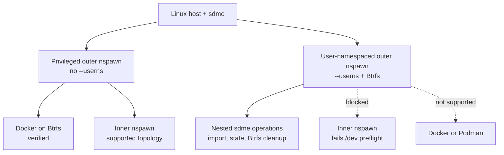
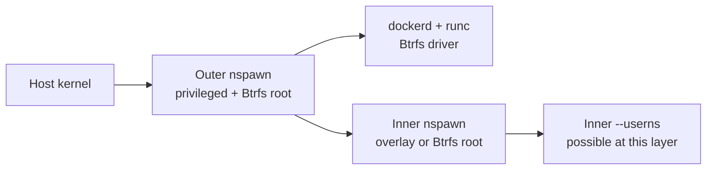
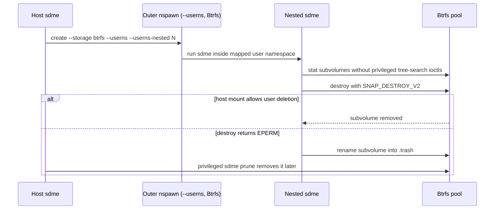
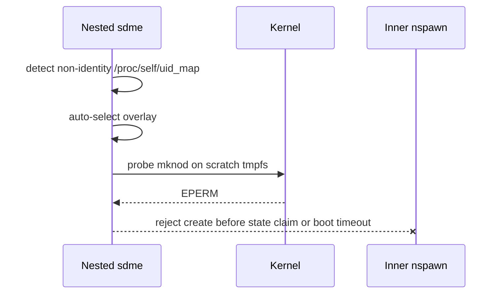

# sdme nesting: supported topologies

sdme supports nested workloads, but "nested" covers three materially different
topologies. Storage, user namespaces, and the inner runtime determine what
works.



## Support matrix

| Outer container | Inner workload | Status | Required storage |
|---|---|---|---|
| Privileged nspawn | Docker | Verified | Btrfs |
| Privileged nspawn | One inner nspawn layer | Supported topology | Btrfs recommended |
| Userns nspawn | Nested sdme management operations | Supported | Outer Btrfs |
| Userns nspawn | Docker or Podman | Not currently supported or verified | Btrfs does not remove the privilege blockers |
| Userns nspawn | Inner nspawn | Unsupported | Inner `auto` chooses overlay, but boot is still blocked |

## 1. Privileged outer: nested runtimes

The outer container does not use `--userns`, so its root retains the capabilities
needed by inner container runtimes. Use a Btrfs root when the inner runtime needs
a real filesystem; overlay-on-overlay cannot provide a valid writable layer.



- Docker is verified with the Btrfs storage driver, including image build,
  registry push/pull, container execution, and recursive cleanup of Docker's
  nested subvolumes.
- An inner nspawn container may use `--userns`; the outer layer is privileged
  and can create the namespace and mounts. sdme tests one nesting boundary, not
  arbitrary recursive depth.

Example outer container for Docker:

```sh
sudo sdme new --name dockerbox -r ubuntu --storage btrfs \
  --network-veth \
  --capability CAP_NET_ADMIN \
  --system-call-filter bpf \
  --system-call-filter keyctl \
  --system-call-filter add_key
```

Inside it, configure Docker with `"storage-driver": "btrfs"`. The `bpf` syscall
is needed for runc's cgroup v2 device controller; `keyctl` and `add_key` cover
images that use the kernel keyring.

Depth boundary: one nested runtime layer is the supported and tested target.
Further privileged nspawn recursion may work, but depends on systemd, cgroup
delegation, mount propagation, available capabilities, and resources. It is not
an sdme compatibility guarantee.

## 2. Userns outer on Btrfs: nested sdme operations

An outer container created with `--userns` maps its root to an unprivileged host
UID. Btrfs is required for expanded idmapped UID/GID ranges and for managing
nested subvolumes without overlay-on-overlay.



- Supported: nested sdme detection, storage selection, rootfs import/chroot
  staging, stat-based Btrfs inspection, deletion, and `.trash` fallback.
- `--userns-nested N` reserves additional 64K UID/GID ranges. It solves mapping
  capacity only; it does not grant capabilities in the initial user namespace.
- Docker and Podman inside this userns topology are not currently part of the
  supported or verified matrix. Btrfs solves storage nesting, not the remaining
  BPF, cgroup, proc, device, and mount privilege boundaries.

Example outer topology used by the nested verification:

```sh
sudo sdme create --name outer -r ubuntu --storage btrfs \
  --userns --userns-nested 32 --started
```

## 3. Userns outer: inner nspawn is blocked

Nested sdme detects the user namespace. `--storage auto` selects overlay for an
inner container because a Btrfs root cannot complete nspawn's mount setup in
that context. Overlay avoids that Btrfs-specific failure, but does not make the
inner container bootable.



- Explicit inner `--storage btrfs` is rejected because Btrfs is not a
  user-namespace-mountable filesystem and nspawn cannot complete its mount
  choreography there.
- Inner overlay is also unsupported: nspawn still needs device-node creation
  and proc/sysfs mount operations that the nested user namespace cannot perform.
  sdme reports the preflight cause immediately instead of waiting for boot to
  time out.

## Bottom line

Btrfs solves filesystem nesting. `--userns-nested` solves UID/GID mapping
capacity. Neither grants initial-user-namespace capabilities. Privileged nesting
can host Docker and inner nspawn; a userns outer is currently limited to nested
sdme management operations, not another working container-runtime layer.

